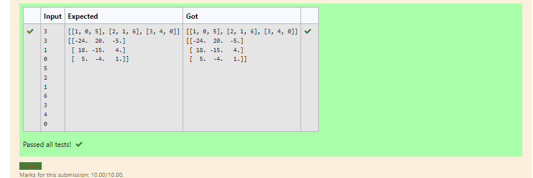

# Inverse-of-matrix

## AIM:
To write a python program to find the inverse 
of a nested array

## ALGORITHM:

### Step 1:
To know the dimensions of the matrix get the input  from the user 
### Step 2:
Create empty lists l1 and l2
### Step 3:
iterations is used to get the user input as lists l1 and l2
### Step 4:
import numpy as np
### Step 5:
using np.linalg.inv() the inverse of the given a matrix is founded 

## PROGRAM:
```
'''
Developed by: Haridharshini.S
reference number:21500176
'''
import numpy as np 
l1,l2=[],[]
row=int(input())
coloumn=int(input())
for i in range(row):
    for j in range(coloumn):
        num=int(input())
        l1.append(num)
    l2.append(l1)
    l1=[]
print(l2)
value=np.array(l2)
inverse=np.linalg.inv(value)
print(inverse)
```

## OUTPUT:

## RESULT:
thus the python program is successfully executed to find inverse of a matrix